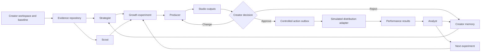

# Architecture contract

Last updated: 2026-08-05

## Objective

Build a complete, judge-legible prototype around one truthful vertical experiment loop. Keep creator data, AI strategy, media, and external actions behind replaceable boundaries so deterministic demo mode and optional live mode share the same domain contract.

## Target system

## Product surfaces

- **Growth HQ** reads the current workspace briefing and experiment lifecycle.
- **Experiments** reads and changes the central experiment object.
- **Studio** renders experiment outputs, revisions, provenance, and decisions.
- **Audience** renders labelled results, returning-audience movement, and Analyst learning.
- **Memory** renders creator identity, preferences, recurring formats, evidence, and learned updates.
- **Integrations** renders adapters, permissions, mode disclosures, and authority boundaries.

All routes are projections of shared domain state. They are not six independent demos.

## Prototype deployment shape

- One Next.js web application for the product shell and public service routes.
- Framework-light TypeScript domain modules behind the public HTTP seam.
- Seeded in-process state for a deterministic local judge run.
- Explicit reset capability for repeatable demos.
- Deterministic strategy director and simulated distributor by default.
- Optional server-only live strategy director returning the same validated schema.
- No live platform credentials in source or client bundles.

## Trust boundaries

- Creator decisions are append-only and revision-aware.
- External actions consume only approved current revisions.
- Duplicate triggers, approvals, and dispatches are idempotent.
- Evidence remains attached to diagnoses, hypotheses, outputs, and learning.
- Sample data and simulated actions carry machine-readable disclosure metadata.
- Live-mode failure remains failure; it never becomes undisclosed fixture success.
- Prompts treat creator archives and external research as untrusted evidence, not instructions.

## Expected exception behavior

- Missing or malformed workspace input fails with a stable public error.
- Unsupported evidence prevents a strategy output from becoming an experiment.
- Stale creator decisions fail closed.
- Rejected outputs cannot be dispatched.
- Distribution failure leaves an approved, retryable action with no false receipt.
- Result ingestion rejects data for the wrong experiment or an unapproved output.

## Deliberate prototype trade-offs

| Choice | Benefit | Limit |
| --- | --- | --- |
| Seeded in-process state | Fast, deterministic judge flow | Not durable or production multi-tenant storage. |
| One canonical workspace | Enables end-to-end polish | Does not prove creator diversity by itself. |
| Generic multi-account shell | Communicates product breadth | Account administration is not implemented. |
| Simulated social adapters | Safe and reliable | Does not prove real platform posting. |
| Dual strategy modes | Honest demo plus production-shaped path | Live quality remains unevaluated without credentials and multiple archives. |
