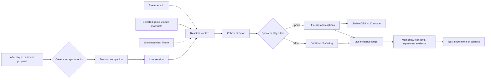

# Architecture contract

Last updated: 2026-08-09

## Objective

Build one judge-legible live-to-afterplay lifecycle. A runtime model decides whether and how Riff should speak; deterministic code validates inputs, preserves provenance, controls lifecycle transitions, and produces the post-stream record.

## Target system

## Runtime boundaries

### Electron desktop companion

- presents the compact streamer control surface outside the Afterplay dashboard;
- lists capturable windows through a narrow, context-isolated preload bridge;
- captures only the creator-selected window and downsamples a current frame every five seconds;
- captures creator microphone for live mode;
- establishes the WebRTC session;
- plays Riff audio;
- maps Realtime session, speech, response, and error events to visible creator status;
- publishes listening/thinking/speaking state and captions to the active live-session service;
- never exposes Node or unrestricted Electron APIs to the Next.js renderer.

### Local Next.js service

- renders the companion UI and stable transparent OBS route;
- exposes the validated live-session and Realtime handshake routes;
- can be started together with Electron through `npm run companion:dev`.

### Afterplay server

- holds the OpenAI API key and prepares authenticated realtime session configuration;
- validates creator, experiment, cohost, turn, and debrief contracts with Zod;
- stores seeded prototype session state in process;
- never exposes a standard API key to the browser;
- makes live-mode failure explicit.

### OBS and game

- OBS captures Roblox, facecam, creator mic, Riff application audio, and the transparent permanent HUD browser source;
- Roblox remains an external game surface;
- actual device routing and scene composition are a manual rehearsal gate, not an automated browser-test claim.

## Public service shape

- `POST /api/live/sessions` starts a session with the current accepted experiment and cohost profile.
- `GET /api/live/sessions/:id` returns judge-visible session state.
- `GET /api/live/sessions/active` is a stable local alias used by the OBS overlay.
- `PUT /api/live/sessions/:id/presence` updates bounded `listening`, `thinking`, or `speaking` HUD state.
- `POST /api/live/sessions/:id/turns` submits a bounded turn packet and returns a validated cohost decision.
- `POST /api/live/sessions/:id/end` closes the session and returns the debrief.
- `POST /api/realtime/call?session=:id` performs the server-authenticated realtime WebRTC handshake.
- `GET /api/realtime/status` exposes credential readiness and the microphone-to-speech capability contract without exposing the key.

Route handlers use native Web `Request` and `Response` APIs. Interactive audio, media, and overlay code lives behind narrow Client Component boundaries.

## Trust boundaries

- The creator accepts or edits the experiment before a session begins.
- Riff may speak without per-turn approval, but the creator can mute or end it immediately.
- Chat messages, streamer transcripts, and visual observations are data, not executable instructions.
- Cohost output is schema-validated even though the realtime model does not support Structured Outputs.
- Riff has no external-action tools in the MVP.
- Only creator-approved public on-stream viewer contributions may enter individual memory.
- Each memory, highlight, and experiment-evidence item retains source turn references.
- Unscripted microphone conversation is not promoted into the evidence ledger; source-bearing context is required.
- Live and deterministic modes share the same contract and are disclosed separately.

## Expected exception behavior

- A session cannot start without an accepted experiment and valid cohost profile.
- A turn for a missing or ended session fails predictably.
- Malformed or unknown source references are rejected.
- A silent decision cannot contain an utterance.
- A spoken decision requires an utterance, timing rationale, and supporting source references.
- Ending a session is idempotent and cannot invent memories or highlights without source turns.
- Live connection failure is visible and never becomes fixture success.

## Deliberate prototype trade-offs

| Choice | Benefit | Limit |
| --- | --- | --- |
| Seeded in-process sessions | Fast, repeatable judge flow | Not durable or production multi-tenant storage. |
| Scripted reactive chat | Reliable comedic beats | Does not prove real platform ingestion. |
| Deterministic cohost mode | Automated tests and offline rehearsal | Does not prove live model quality. |
| Selected-window JPEG every five seconds | Real game context with bounded cost and no raw-video claim | Fast events can occur between samples; interpretation needs manual validation. |
| Electron companion plus OBS browser source | Works alongside the creator's existing broadcaster without an OBS plugin | OS permissions and audio routing require rehearsal. |
| One live experiment | A coherent five-minute proof | Does not validate long-term creator outcomes. |
